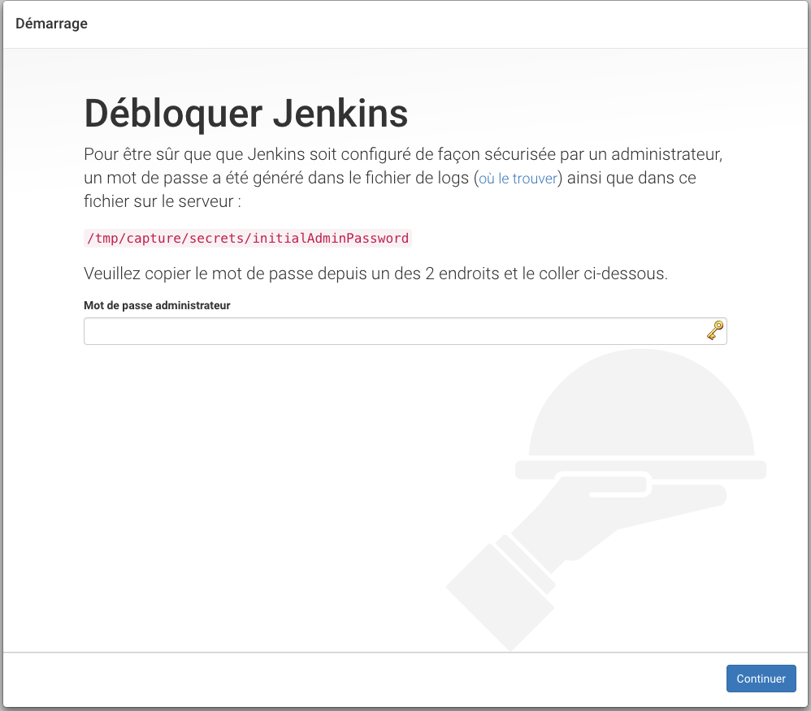
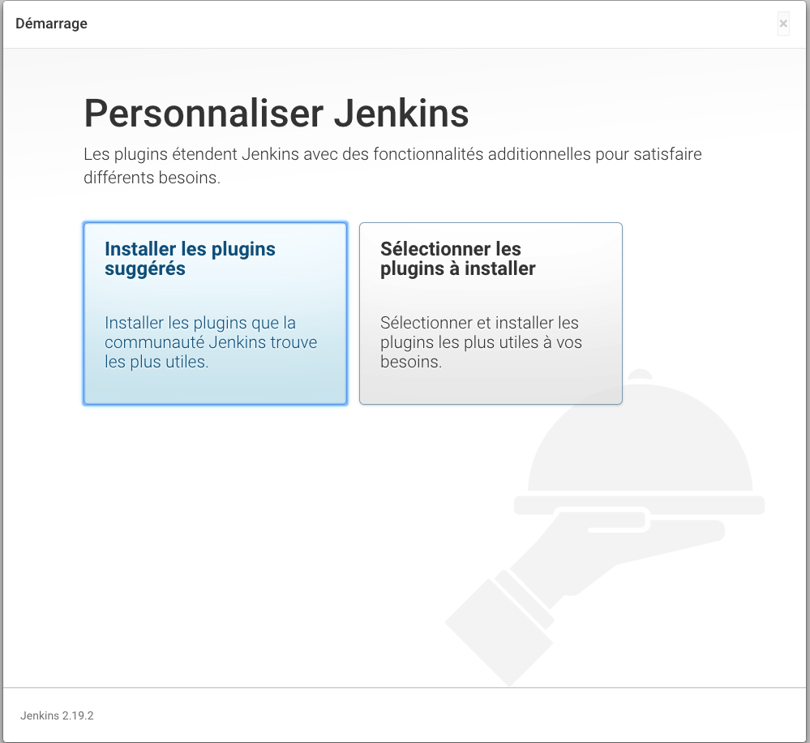
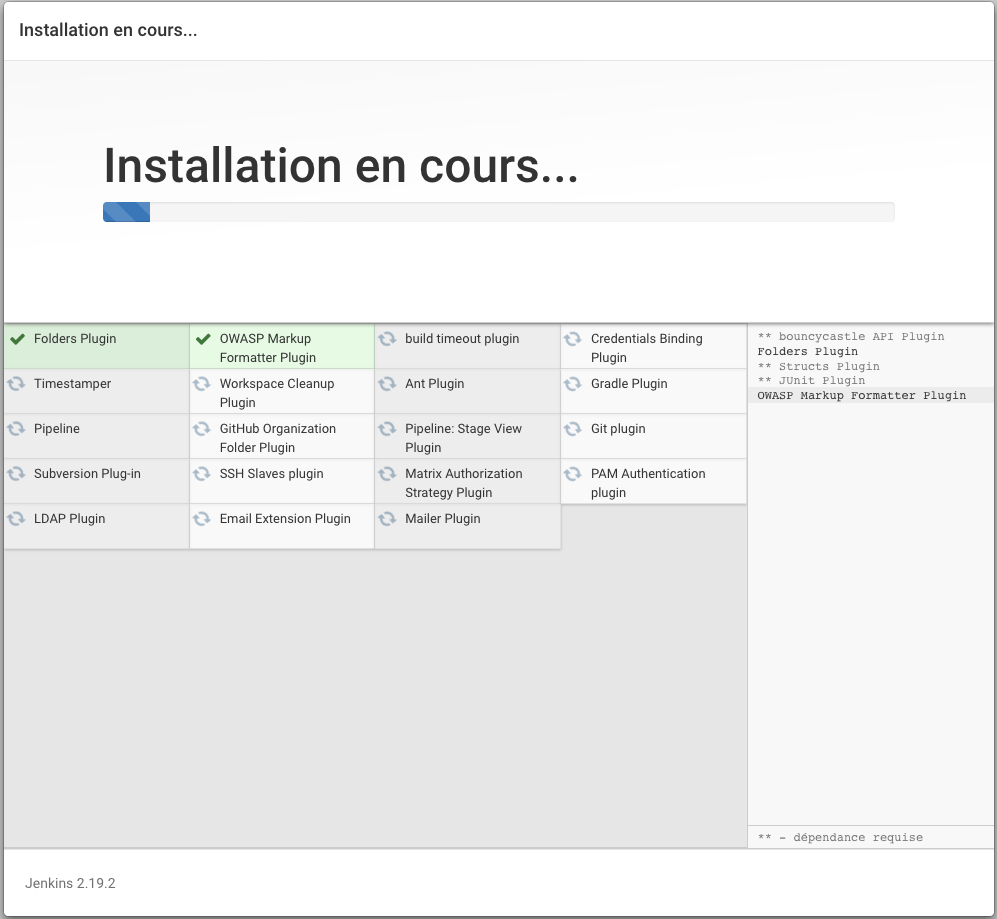
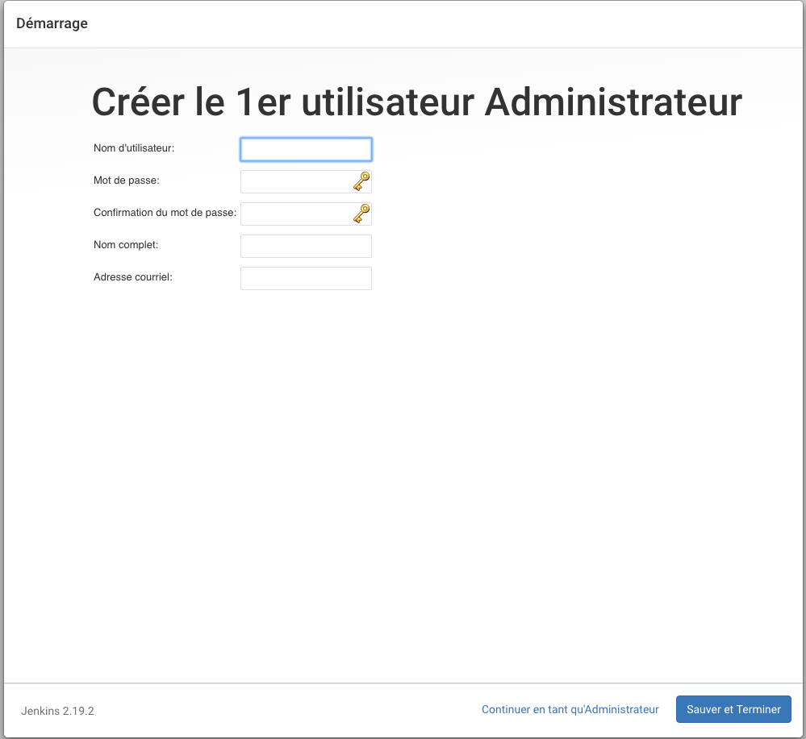
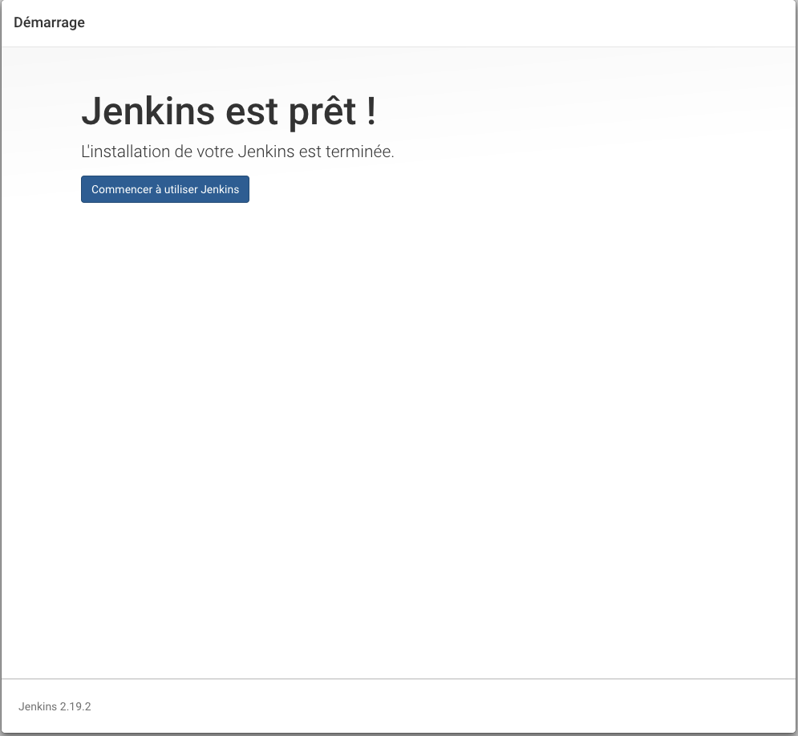

# Jenkins Workshop

## Préparation de l’environnement

### Outils

Vérifier la version de java installée, et que Java est bien déclaré dans le PATH


Si non, vérifier l’installation de Java, autrement ajouter le chemin vers la JDK dans le PATH

```
export PATH=$JAVA_HOME/bin
```

### Démarrer Jenkins

Se placer dans le dossier où jenkins.war a été téléchargé.

```
$ java -jar jenkins.war
```

Par défaut, Jenkins travaille dans $HOME/.jenkins et écoute sur 0.0.0.0/8080.

Pour travailler dans un chemin différent, utiliser la variable d’environnement JENKINS_HOME.

Vous pouvez consulter [https://wiki.jenkins-ci.org/display/JENKINS/Starting+and+Accessing+Jenkins](https://wiki.jenkins-ci.org/display/JENKINS/Starting+and+Accessing+Jenkins) pour connaître la liste des options disponibles.

Au démarrage, Jenkins génère un code de déverrouillage afin d’empêcher l’accès à votre instance par quelqu’un d’autre.



Ce code s’affiche dans la console et sera demandé lors du premier accès à l’instance et jusqu’à la sécurisation de l’instance par un utilisateur admin avec un mot de passe de votre choix.

Installer les plugins suggérés. Vous pourrez installer des plugins supplémentaires plus tard si besoin.





Créez un administrateur et terminez l’assistant.





### Déclaration des outils

Nous allons utiliser une JDK ainsi que Maven pour construire certains projets. Nous allons indiquer à Jenkins où trouver ces outils.

* Administrer Jenkins > Configuration globale des outils

    * JDK > Installations JDK  > Ajouter JDK

        * Nom: JDK8

        * Décocher ‘Install automatically’

        * Entrez le chemin vers la JDK

            * Windows: `C:\Program Files\Java\jdk1.8.0_112`

            * MacOS: `/Library/Java/JavaVirtualMachines/jdk1.8.0_112.jdk/Contents/Home`

    * Maven > Ajouter Maven

        * Nom: Maven 3

        * Décocher ‘Install automatically’

        * Entrez le chemin vers votre installation Maven

## Premier pipeline

Overview: [https://jenkins.io/doc/book/pipeline/overview/](https://jenkins.io/doc/book/pipeline/overview/)

Reférence : [https://jenkins.io/doc/pipeline/steps/](https://jenkins.io/doc/pipeline/steps/)

Exemples: [https://github.com/jenkinsci/pipeline-examples](https://github.com/jenkinsci/pipeline-examples)

La définition des pipelines se fait via un DSL Groovy interprété via un interpréteur CPS (Continuation Passing Style) qui permet de mettre en pause un pipeline à tout moment (ce qui rend possible un redémarrage de Jenkins pendant l’exécution d’un pipeline).

## Définitions

**Step**: brique de base d’un pipeline. Chaque step est typée et indique à Jenkins quoi faire.

**Node**: se réfère à une exécution sur un noeud distant. Chaque noeud dispose de son propre workspace. On peut se référer à des noeuds ayant des propriétés particulières via le système de labels de Jenkins.

**Stage**: Étapes de haut niveau du pipeline. Un pipeline est constitué d’un enchaînement de Stages qui servent délimiter les différentes parties d’exécution du pipeline. Les différents stages définis dans le pipeline permettent de le représenter graphiquement.

### Etapes disponibles

La liste des étapes disponibles dépend des plugins installés sur l’instance, chaque plugin pouvant contribuer de nouvelles étapes. L’écran **Pipeline Syntax**, accessible via <jenkins_url>/pipeline-syntax/, liste toutes les étapes disponibles et permet de générer les code snippets pour les utiliser.

### Exemples

#### Exemple 1 : Pipeline minimal

Un pipeline minimal peut s’écrire ainsi:

```
node {
    echo 'Hello from Pipeline'
}
``` 

#### Exemple 2 : Utilisation des stages

Les stages permettent de structurer le rendu de la progression d’un pipeline.

```
stage(‘Checkout’) {
 sleep 5
}
stage(‘Build’) {
 sleep 8
}
stage(‘Test’) {
 sleep 10
}
stage(‘Deployment’) {
  sleep 1
}
```

Le rendu de ce pipeline se fera de la façon suivante


#### Exemple 3 : Exécutions en parallèle

Le mot-clé parallel permet d’exécuter plusieurs blocs en parallèle et d’attendre avant qu’ils aient tous finis de s’exécuter (fork-join) avant de continuer le pipeline.

```
parallel 'integration-tests':{
    node('mvn-3.3'){}
}, 'functional-tests':{
    node('selenium'){}
}
```

## Deuxième Pipeline

[https://github.com/Vlatombe/game-of-life](https://github.com/Vlatombe/game-of-life/tree/master)

Ce projet est un exemple de projet java utilisant Maven comme outil de build, qui va nous permettre de pratiquer les différentes intégrations de pipeline avec divers plugins.

### Trouver le bon plugin

#### Références
* [https://plugins.jenkins.io/](https://plugins.jenkins.io/)
* [https://jenkins.io/doc/pipeline/steps/](https://jenkins.io/doc/pipeline/steps/)
* http://votre-url-jenkins/pipeline-syntax/

#### Exercice

1. Créer un pipeline permettant de récupérer le code du projet (mot-clé _checkout_)
2. Ajouter une étape permettant de builder le projet avec Maven. Je vous recommande d’utiliser le
[Pipeline Maven plugin](https://wiki.jenkins-ci.org/display/JENKINS/Pipeline+Maven+Plugin) pour vous simplifier la tâche.
3. Ajouter des stage ‘Checkout’ et ‘Build’ afin d’avoir une représentation visuelle du pipeline
4. Ajouter des rapports de builds (JUnit, Checkstyle, Findbugs, PMD, Warnings...)
5. On voudrait pouvoir accélérer l'exécution des tests. Quels mécanismes ou plugins pourrait-on utiliser pour y parvenir?

### Mise au point d'un pipeline

* checkout
* Fonction replay
* stashes
* variable `currentBuild`
* Gérer les erreurs, retries

### Environnement de build

* Déclarer les installations de Java et de Maven
Mot-clé: `tool`

### Validation manuelle

Dans certains cas, on veut pouvoir contrôler l’exécution d’une partie du pipeline via une validation manuelle.
On peut utiliser ce mécanisme pour promouvoir un build dans un environnement, ou bien déclencher la release à partir d’un build.

Mot-clé: `input`.

## Pipeline-as-code

### Principe

On peut définir un pipeline dans Jenkins directement, mais il est plus aisé de travailler dans un vrai éditeur de texte
plutôt que dans un textarea dans un navigateur. Le fait de stocker la définition du pipeline dans un SCM permet de le garder
 proche du code qu'il concerne et de le faire évoluer en m￿￿ême temps en cas de besoin.

Lorsque l’on souhaite stocker la définition du pipeline dans un SCM, il nous suffit de sélectionner l’option
**Pipeline script from SCM** lors de la création du pipeline. Ensuite, nous devons saisir quel SCM utiliser.
La convention est de stocker la définition du pipeline dans un fichier nommé **Jenkinsfile** situé à la racine du repository.

Une fois dans le contexte d’exécution du pipeline, il est possible de récupérer le code correspondant au Jenkinsfile via l'étape **checkout scm**.

#### Exercice

* Convertir le pipeline précédent pour qu'il soit exécuté dans à partir du SCM.

### Sécurité

Il existe 2 modes d’exécutions de pipelines: _trusted_ et _untrusted_. Les pipelines définis dans Jenkins peuvent utiliser
l’un ou l’autre, les ceux définis dans un SCM sont toujours untrusted.

En mode _trusted_, aucune restriction n’est appliquée au code du pipeline. Ce qui permet de faire potentiellement des
choses dangereuses, comme tuer la JVM Jenkins ou bien utiliser les APIs Jenkins pour récupérer toutes sortes d’informations. 

En mode _untrusted_, seule une liste blanche d’instructions peut être exécutée. Un administrateur Jenkins peut rajouter
des instructions à cette liste blanche si nécessaire. Dans ce mode il n’est pas possible d’appeler `System.exit(0)` sans
qu’un administrateur l’ait autorisé explicitement.

### Projets multi-branches

L’évolution logique de pipeline-as-code est de prendre en compte le cycle de vie du projet. Les SCMs modernes comme Git
permettent de travailler sur plusieurs branches et il existe de nombreux produits sur le marché qui ont repris le concept
de pull request introduit par GitHub (GitHub, BitBucket, Gitlab, Gogs…).

Jenkins permet de créer des projets qui sont capables de scanner l’intégralité des branches d’un repository ainsi que
des pull requests. On peut ainsi valider toutes les branches et s’assurer de la qualité des pull requests avant de les merger.

On peut même aller plus loin et scanner une organisation (groupe de repositories) complète en utilisant le type `Github Organization`.

#### Exercice

* Reprendre le pipeline précédent pour le builder grâce à un pipeline multi-branche.

### Réutilisation du code

* [workflow-cps-global-lib-plugin](https://github.com/jenkinsci/workflow-cps-global-lib-plugin)
* [Shared Libraries](https://jenkins.io/doc/book/pipeline/shared-libraries/)

Jetez un coup d'oeil à ces repositories de mon collègue [Adrien Lecharpentier](https://github.com/alecharp).

* [alecharp/jenkins-library](https://github.com/alecharp/jenkins-library)
* [alecharp/build-tools](https://github.com/alecharp/build-tools)

### Pipelines déclaratifs

* [Pipeline Model Definition Plugin - Getting started](https://github.com/jenkinsci/pipeline-model-definition-plugin/wiki/getting%20started)

### Bonnes pratiques

* [Pipeline scalability best practices](https://jenkins.io/blog/2017/02/01/pipeline-scalability-best-practice/)
